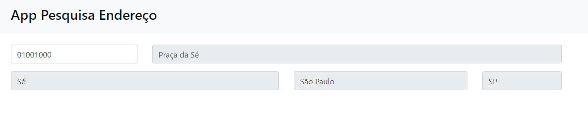

<h1 align="center">App Pesquisa Endereço</h1>

<!-- Telas -->

## Sobre o projeto

### Tela

    

API de consulta de CEPs utilizando a API ViaCEP

### Recursos usados

- [Javascript](https://www.javascript.com/)
- [Bootstrap 4](https://getbootstrap.com/)
- [API - ViaCEP](https://viacep.com.br/)
- [Ajax](https://api.jquery.com/jquery.ajax/)

## Considerações finais

Projeto desenvolvido totalmente para fins acadêmicos.
